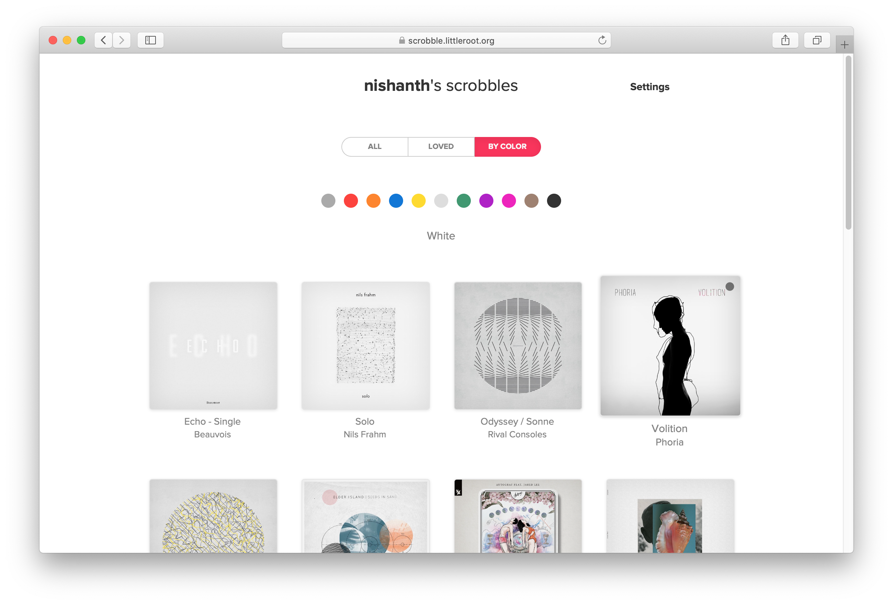

# scrobble

[`scrobble.allele.cc`](https://scrobble.allele.cc) is an Apple Music scrobbling
service, with a client app available for macOS.

See an [example profile](https://scrobble.allele.cc/u/nishanth).

## Getting Started

See the [Guide](https://scrobble.allele.cc/doc/guide) on the website.

## HTTP API

Check out the [API documentation](https://scrobble.allele.cc/doc/api/v1).

## Download macOS app

Get it from the [Releases](https://github.com/nishanths/scrobble/releases/latest) page.

## Features

* See all scrobbled songs
* See scrobbled songs that you "love" on Apple Music
* Browse scrobbled albums by artwork color
* A detail page for seeing album artwork and song metadata
* Graphs and insights on top played songs, longest songs, most listened artists

## Build Status

## Attribution

The macOS app icon is Gramophone by Mahmure Alp from [thenounproject.com](https://thenounproject.com).

The macOS menu bar icon is Flower by nitut786 from [thenounproject.com](https://thenounproject.com).
